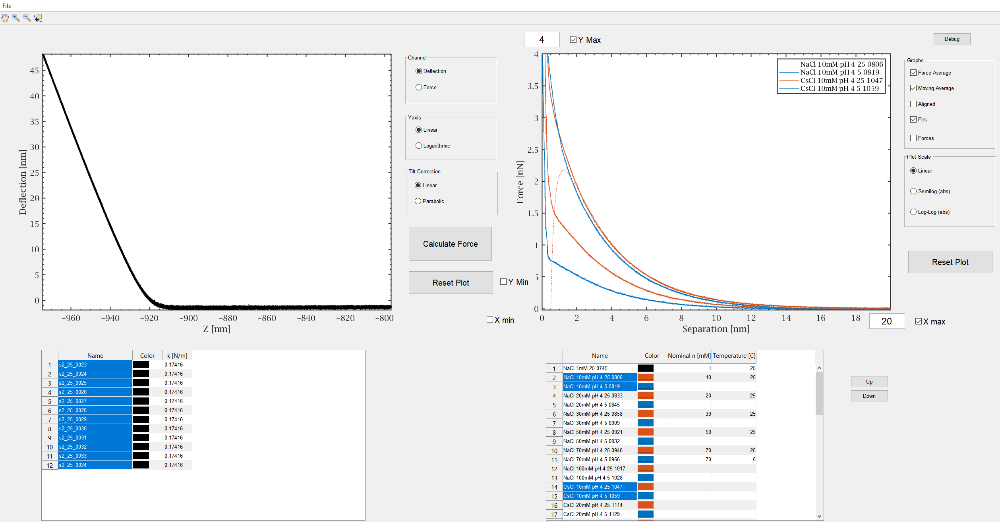
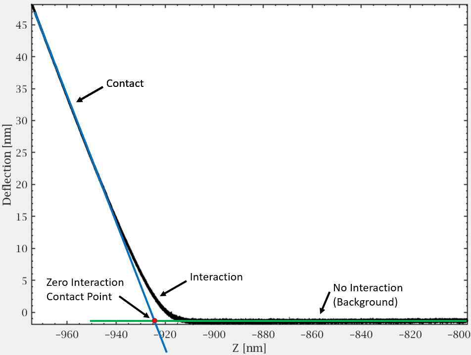

# CyPlotContact
CyPlotContact is a MATLAB GUIDE program I wrote at early stages of my PhD in order to calculate and analyze Contact Mode Colloidal AFM force measurements. The program imports Igor's software IBW files containing deflection and stage position information and converts them into force vs distance curves. The program features a grouping mechanism that allows to group multiple force curves and average them to increase signal-to-noise ratio.

The "Cy" in the program name is after the name of the main AFM I worked on, which is Cypher VRS by Asylum Research.

## Features
- Easy and quick calculation of force curves
- Grouping of force curves and represent them by an average curve
- Coloring groups for further convenience
- Exports MATLAB struct with all relevant force group data
- Spring constant is extracted from the IBW file
- Fits data to DLVO theory. Other fit models can be added easily
- Plot in linear, semiology and log-log scales.
- Option to plot an arbitrary function together with the force curves.

Note that many of the program options are available through right-click on the relevant area (tables and figures)

## Images
The image below shows file import and force calculation on the left, and force groups on the right.

## Force Calculation Algorithem
The image below shows a typical deflection vs stage z-position measurement. The measurement can be ambiguously separated to three regions: 
1.	No Interaction (Background) Region – In this region the tip and the surface are too distant to exhibit significant interaction, thus what measured is a background signal, caused mainly by optics, which is subtracted from the total signal is the process of the force calculation.
2.	Interaction Region – At this region the tip and the surface are close enough to produce a significant interaction that is recorded by deflection of the cantilever.
3.	Contact Region – At this region the tip and the surface are in stiff contact and hence the change is deflection is 1:1 compatible with the change is the z-position. This region is used to calculate the conversion factor of the deflection from volts to meters (usually done during experiment).

Given the above, the algorithm to calculate the force is as followes:
1.	Fit linear lines to the No-Interaction and Contact regions
2.	Calculate their intercept point (marked by a red dot). This is the point of contact in the case of zero interaction between the probe and the surface.
3.	Calibrate z by subtracting the z-position of the intercept point from the raw data of z.
4.	Calculate the separation by adding the deflection and z, namely d+z.
5.	Clean the deflection signal from the background signal by subtracting linear extrapolation of the No-Interaction region.
6.	Calculate the force by factoring the deflection by the spring constant.

